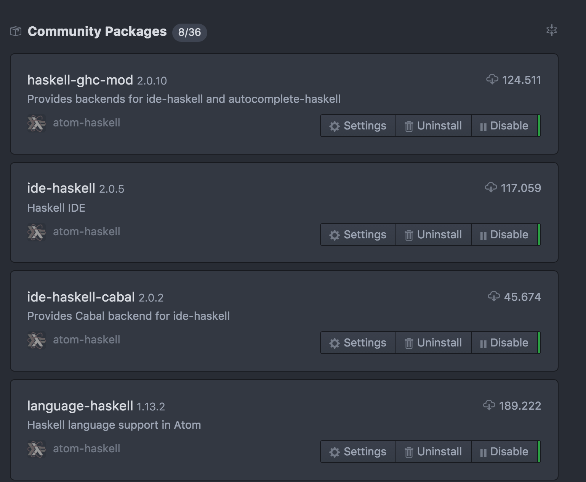

#Editor
Atom 1.19

With installed plugins

- Haskell Ghc Mod
- Ide Haskell
- Language Haskell

[Atom and slack](https://github.com/atom-haskell/haskell-ghc-mod/wiki/Using-with-stack)

```bash
  $ stack build ghc-mod
```


